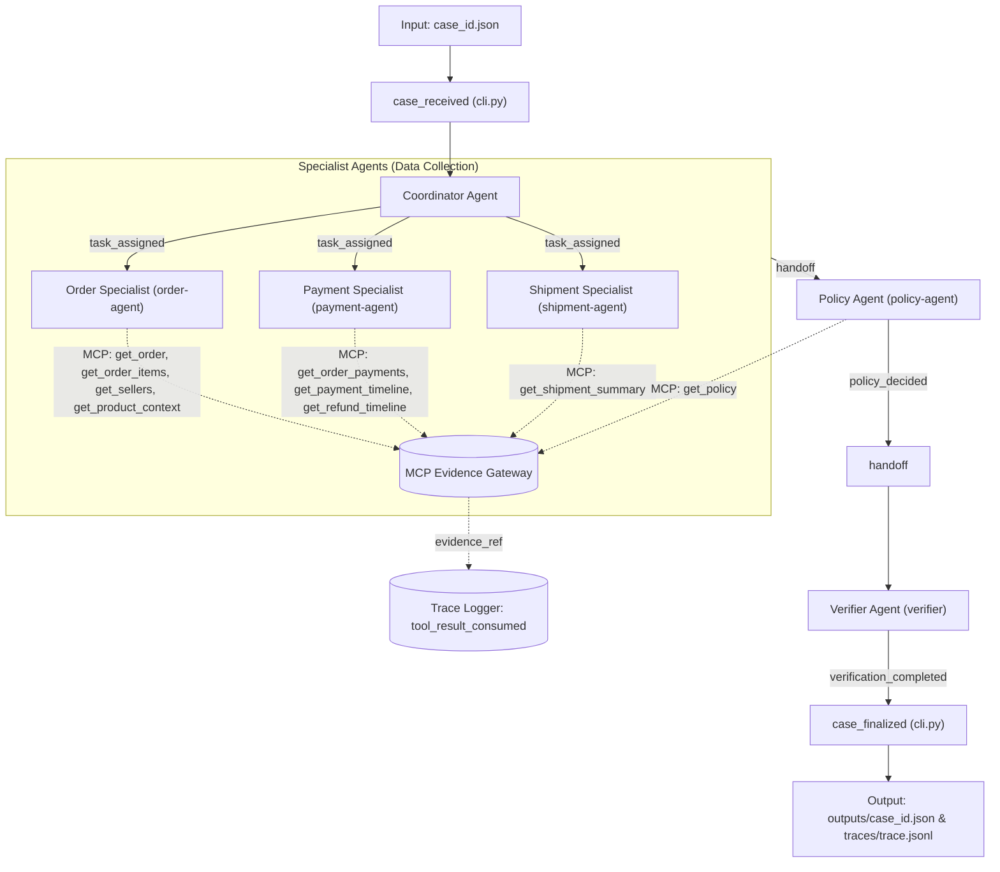

# L3A Architecture Record

Tài liệu thiết kế kiến trúc hệ thống Multi-Agent điều tra khiếu nại thương mại điện tử (K4 L3A - Multi-Agent MCP + A2A). Mô tả các quyết định kỹ thuật có thể kiểm chứng, phân quyền công cụ, giao thức A2A và cơ chế xử lý sự cố.

---

## 1. System Overview

Hệ thống được thiết kế dưới dạng **Directed Acyclic Graph (DAG) State-Machine** theo phong cách LangGraph (quản lý trạng thái và chuyển dịch bước rõ ràng, không thêm phụ thuộc nặng), điều phối toàn bộ vòng đời từ `inputs/<case_id>.json` qua MCP Evidence Gateway đến đầu ra chuẩn `outputs/<case_id>.json` và nhật ký truy vết `traces/trace.jsonl`.



* **Vòng đời trace chuẩn hóa:** `case_received` $\rightarrow$ `task_assigned` (x3) $\rightarrow$ `tool_result_consumed` (các MCP calls) $\rightarrow$ `handoff` (coordinator $\rightarrow$ policy-agent) $\rightarrow$ `policy_decided` $\rightarrow$ `handoff` (policy-agent $\rightarrow$ verifier) $\rightarrow$ `verification_completed` $\rightarrow$ `case_finalized`.

---

## 2. Agent Ownership & Tool Permissions Matrix

Hệ thống phân chia trách nhiệm rành mạch theo nguyên tắc **Đặc quyền tối thiểu (Principle of Least Privilege)**: không agent nào được gọi công cụ ngoài phạm vi thẩm quyền của mình.

| Actor | Thẩm quyền / Input | Tool được phép (Allowed) | Tool bị cấm (Forbidden) & Lý do | Output / Trách nhiệm chính |
| :--- | :--- | :--- | :--- | :--- |
| **Coordinator** | `case_id`, `customer_request` | *Không gọi MCP tools* | Tất cả MCP tools | Phân bổ tác vụ (`task_assigned`), điều phối luồng, bàn giao sang Policy Agent. |
| **Order Specialist** (`order-agent`) | `order_id` | `get_order`<br>`get_order_items`<br>`get_sellers`<br>`get_product_context` | `get_customer_history` *(Bị cấm: yêu cầu `customer_unique_id` mà đơn hàng chỉ có `customer_id`, gọi sẽ gây lỗi và vi phạm least-privilege)* | Thu thập bằng chứng đơn hàng, phân tích trạng thái hủy/tồn tại, gom `item_ids`, `seller_ids`. |
| **Payment Specialist** (`payment-agent`) | `order_id` | `get_order_payments`<br>`get_payment_timeline`<br>`get_refund_timeline` | `get_customer_history`<br>Các tool vận chuyển/kho | Thu thập chứng từ thanh toán, timeline đối soát, phát hiện thanh toán phân tách hoặc trừ trùng, gom `payment_references`. |
| **Shipment Specialist** (`shipment-agent`) | `order_id` | `get_shipment_summary` | Các tool thanh toán/sản phẩm | Thu thập mốc thời gian giao nhận, đối chiếu hạn giao người bán vs ngày bưu cục giao khách, gom `shipment_ids`. |
| **Policy Agent** (`policy-agent`) | `policy_version`, bằng chứng từ specialists | `get_policy` | Các tool điều tra thực địa | Đối chiếu khiếu nại với evidence thực tế, áp dụng quy định chính sách sàn, xác định `primary_issue`, tính toán tiền hoàn, phân định bên chịu trách nhiệm. |
| **Verifier** (`verifier`) | Dự thảo output & tập `evidence_refs` | *Không gọi MCP tools* | Tất cả MCP tools | Kiểm tra toàn bộ 7 quy tắc bất biến (Invariants), bảo đảm tính nhất quán tài chính và schema trước khi xuất kết quả. |

---

## 3. Giao thức A2A (Agent-to-Agent) & State Envelope

### 3.1. Cấu trúc State Envelope
Các Agent tương tác và truyền tải ngữ cảnh thông qua một State Envelope có cấu trúc xác định trong suốt vòng đời của case:

```json
{
  "case_id": "L3A_CASE_001",
  "claimed_order_id": "e2a03ccf5ea816036608b2d8c3ab8e60",
  "policy_version": "EC_POLICY_V1",
  "evidence": {
    "get_order": { "evidence_ref": "ev_...", "data": { ... } },
    "get_order_items": { "evidence_ref": "ev_...", "data": [ ... ] },
    "get_order_payments": { "evidence_ref": "ev_...", "data": [ ... ] },
    "get_shipment_summary": { "evidence_ref": "ev_...", "data": { ... } },
    "get_policy": { "evidence_ref": "ev_...", "data": { "rules": { ... } } }
  },
  "evidence_refs": ["ev_order_...", "ev_payment_...", "..."],
  "entities": {
    "order_ids": ["e2a03cc..."],
    "item_ids": ["item_1", "item_2"],
    "seller_ids": ["seller_1"],
    "payment_references": ["e2a03cc...:1:credit_card"],
    "shipment_ids": ["e2a03cc..."]
  },
  "inferred_facts": {
    "is_order_canceled": true,
    "is_delivery_late": false,
    "actual_freight_brl": 18.0,
    "actual_total_paid_brl": 79.0
  }
}
```

### 3.2. Quy tắc Correlation & Thứ tự Handoff
1. **Correlation ID:** Mọi trace event và lệnh gọi tool đều bắt buộc đính kèm `case_id` để bảo đảm audit trail độc lập giữa các case.
2. **Deterministic Sequence:** Thứ tự thực thi bảo đảm tính tất định:
   `task_assigned` (cho 3 specialists) $\rightarrow$ thu thập evidence $\rightarrow$ `handoff` (coordinator $\rightarrow$ policy-agent) $\rightarrow$ `policy_decided` $\rightarrow$ `handoff` (policy-agent $\rightarrow$ verifier) $\rightarrow$ `verification_completed`.
3. **Payload Sanitization:** Chỉ ghi nhận các sự kiện quan sát được (`event_type`, `actor`, `target`, `decision_code`, `evidence_refs`) vào trace. Tuyệt đối không trace prompt, chain-of-thought hay secret API keys.

---

## 4. Evidence Lifecycle & Provenance

1. **Khởi tạo và Audit:** Mọi evidence bắt buộc được cấp phát qua `EvidenceGateway.call()`. Server MCP ghi nhận audit log tương ứng với `team_api_key`, `run` và `case_id`.
2. **Trace Linkage:** Ngay sau khi một tool trả về dữ liệu thành công, agent phụ trách phát sinh ngay event `tool_result_consumed` với đúng `evidence_ref` tương ứng. Đây là điều kiện bắt buộc để đạt trọn vẹn điểm **Provenance (15%)** và **Workflow (5%)**.
3. **Scope & Deduplication:**
   * Mỗi `evidence_ref` chỉ có giá trị nội bộ trong đúng case đó; nghiêm cấm sử dụng chéo giữa các case.
   * Danh sách `evidence_refs` ở cấp độ case được khử trùng lặp (`_unique`), tối đa 30 refs.
   * `claim_assessments[].evidence_refs` là tập con chặt chẽ (strict subset) hỗ trợ trực tiếp cho claim đó.

---

## 5. Resilience & Failure Policy

Bảng chính sách xử lý sự cố bảo đảm hệ thống vận hành liên tục, không crash và tuân thủ nguyên tắc không phỏng đoán dữ liệu:

| Sự cố phát sinh | Cơ chế Retry | Phương án Fallback | Tác động Confidence / Trace |
| :--- | :--- | :--- | :--- |
| **MCP Timeout / Transport Error** | Tối đa 2 lần retry (idempotent call với cùng `case_id` và tham số). | Bỏ qua tool lỗi, tiếp tục thực thi các tool khác. Tuyệt đối không tự bịa data. | Không emit `tool_result_consumed` cho tool thất bại. Giảm confidence tương ứng. |
| **Tool không tồn tại / Invalid Args** | Thử lại tối đa 2 lần rồi bỏ qua. | Đánh dấu nhóm dữ liệu bị khuyết thiếu. | Verifier ghi nhận `verified_with_warnings`. |
| **Bất đồng bộ dữ liệu (Data Conflict)** | Không retry. | Lưu giữ dữ liệu các nguồn, ghi nhận 1 bản ghi vào `data_conflicts[]` với `resolution_code="use_first_observed"`. | Thể hiện trong output JSON, không làm sai lệch trace. |
| **Toàn bộ Specialist bị lỗi / Mất kết nối** | Không retry thêm sau khi hết lượt. | Xuất kết quả an toàn: `insufficient_evidence`, trạng thái `needs_investigation`, tiền hoàn `0.0`. | `policy_decided=insufficient_evidence`, `verification_completed=fallback_insufficient_evidence`. |
| **`get_policy` thất bại** | Retry 2 lần. | Sử dụng `_FALLBACK_RULES` (snapshot chuẩn của `EC_POLICY_V1`). | Ghi nhận fallback, giữ nguyên tính hợp lệ của các evidence nhóm khác. |

---

## 6. Verification Invariants & Self-Healing Guardrail (Reflexion-inspired)

Dựa trên nguyên lý **Self-Refine & Reflexion (Shinn et al., NeurIPS 2023)**, Verifier không chỉ kiểm tra thụ động mà đóng vai trò **Self-Healing Guardrail**: chủ động đối soát và tự sửa (auto-correct) các bất đồng bộ trước khi emit `verification_completed` và trả về kết quả:

1. **Schema Compliance:** `schema_version` đúng chuẩn `"day09-l3a-output-v2"`; `case_id` khớp 100% với file input; `primary_issue` thuộc enum hợp lệ.
2. **Financial Consistency & Healing:**
   * $\sum (\text{refund\_lines.amount\_brl}) == \text{recommended\_refund\_brl}$.
   * Nếu `recommended_refund_brl == 0.0` thì `refund_lines` được tự động chuẩn hóa về mảng rỗng `[]`.
   * Nếu `recommended_refund_brl > 0.0`, tự động đồng bộ hóa `refund_lines` khớp chính xác số tiền hoàn và `order_id`.
   * Đơn vị tiền tệ bắt buộc cố định: `"currency": "BRL"`.
3. **Evidence Integrity:** Mọi `evidence_ref` trong output phải khớp định dạng `^ev_[A-Za-z0-9_-]{20,96}$`, thuộc về case hiện tại và đã được ghi nhận trong sự kiện `tool_result_consumed`.
4. **Entity Scope:** `order_ids` chứa duy nhất `claimed_order_id`; các ID sản phẩm, người bán và thanh toán phải được trích xuất thực tế từ payload evidence.
5. **Responsibility Resolution:** Nếu bên chịu trách nhiệm có `party_type == "seller"` và khuyết `party_id`, Verifier tự động điền mã `seller_id` thực tế từ evidence.
6. **Claim-Evidence Consistency:** Mọi `claim_assessments[].evidence_refs` phải là tập con của `output.evidence_refs`. Tự động loại bỏ bất kỳ ref nào không tồn tại trong case. Claim `requested_full_refund` chỉ được gán `supported` khi `recommended_refund_brl > 0`.
7. **Confidence Calibration:** Giới hạn tự động độ tin cậy trong khoảng $[0.40, 0.95]$ (không bao giờ dùng $1.00$ tuyệt đối):
   * Đủ 4 nhóm (Order, Payment, Shipment, Policy): $0.90$
   * Thiếu 1 nhóm dữ liệu: $0.75$
   * Thiếu từ 2 nhóm dữ liệu trở lên: $0.60$ (hoặc $0.40$ nếu fallback toàn bộ).

---

## 7. Reproducibility & Limits

- **Môi trường:** Python 3.11+, dựa trên các thư viện quy định trong [pyproject.toml](file:///d:/VinAI/Competition/K4-L3A-MultiAgent-MCP-A2A/pyproject.toml) (`mcp`, `httpx2`, `jsonschema`).
- **Giới hạn gọi tool:** Tối đa 9 calls/case (4 Order + 3 Payment + 1 Shipment + 1 Policy).
- **Tính tất định:** Luồng chạy không phụ thuộc vào random seed, logic suy luận dựa trên dữ liệu bằng chứng và chính sách sàn.
- **Bảo mật:** Bộ đóng gói [src/student_agent/submission.py](file:///d:/VinAI/Competition/K4-L3A-MultiAgent-MCP-A2A/src/student_agent/submission.py) tự động quét và loại bỏ toàn bộ chuỗi nhạy cảm (`sk-team-...`) trước khi tạo file submission ZIP.
